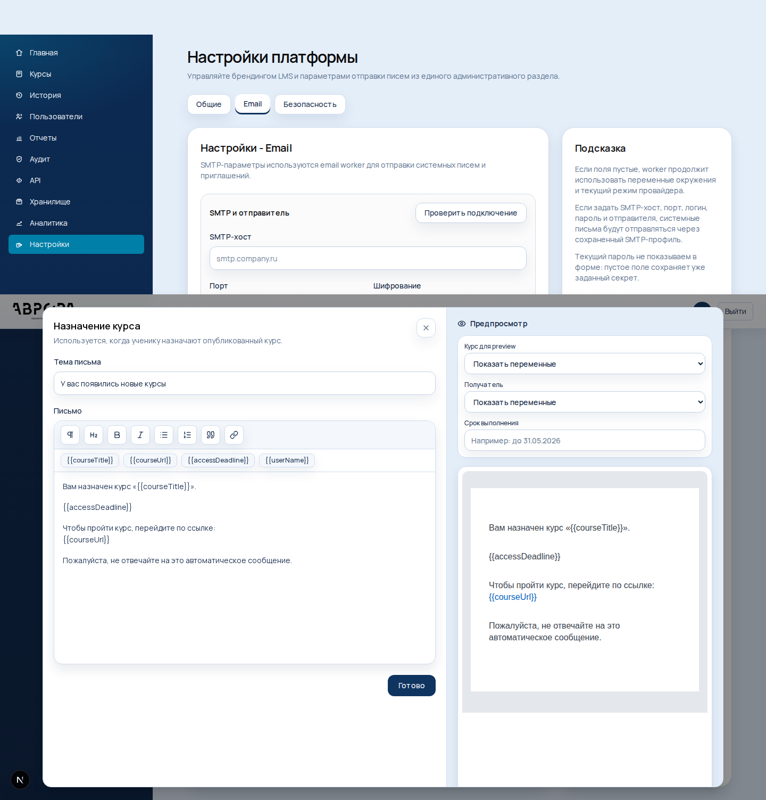
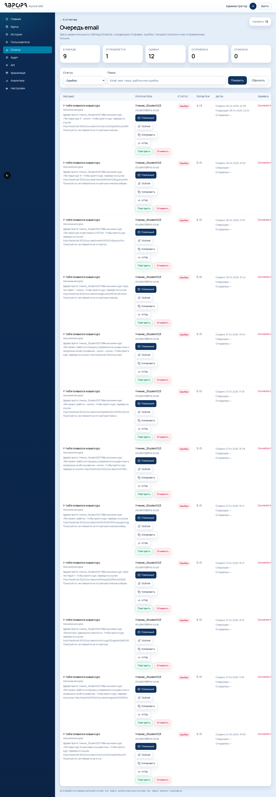
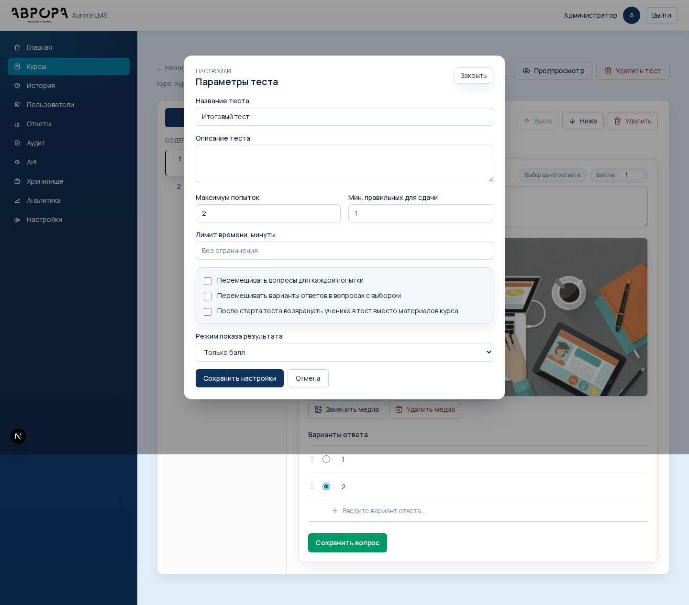
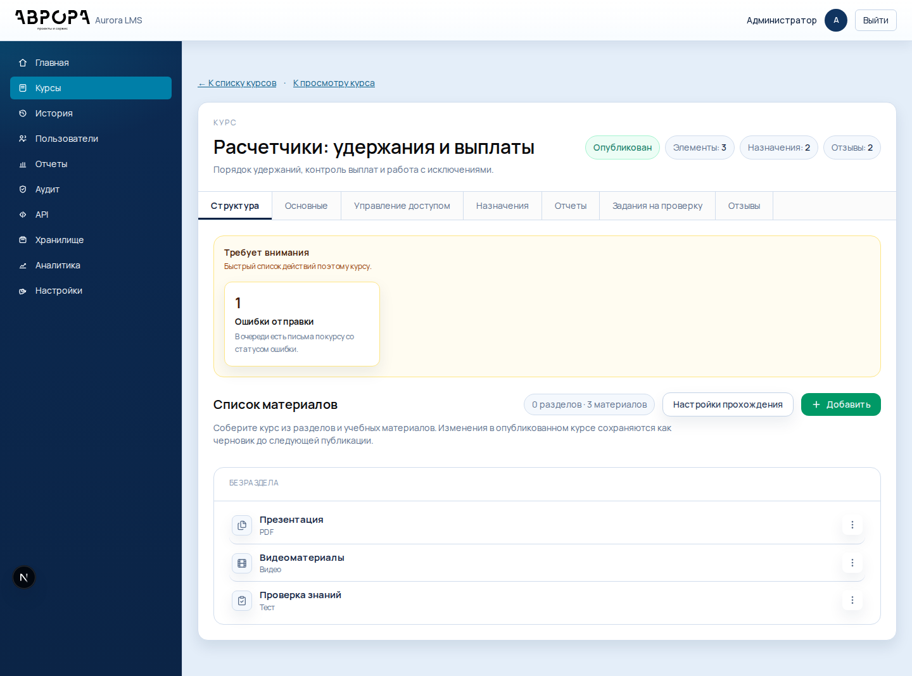
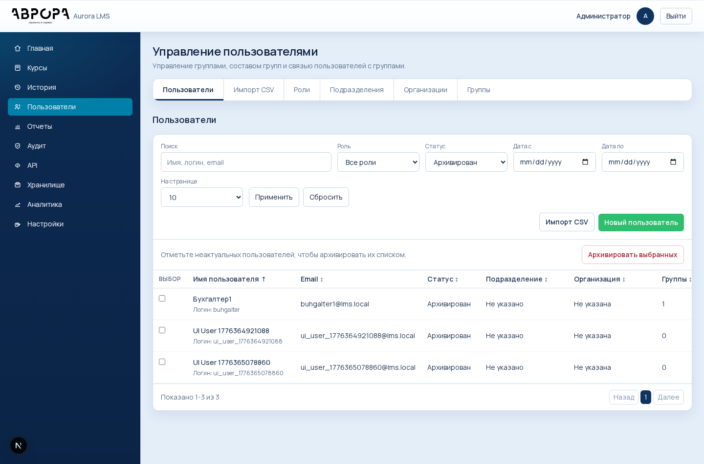

# LMS Course 3: изменения и проверка

Дата: 13.05.2026

## 1. Редактор писем

Где открыть: `Настройки -> Email -> Шаблоны писем -> Назначение курса`.

Что изменилось:

- шаблоны писем отображаются списком;
- для письма о назначении курса добавлен визуальный HTML-редактор;
- предпросмотр строится из текущего текста письма, а не из предопределенной верстки;
- для preview можно выбрать реальный курс, получателя и срок выполнения;
- шаблон сертификата вынесен в настройки как неиспользуемый сценарий.



## 2. Очередь email

Где открыть: `Отчеты -> Очередь email`.

Что изменилось:

- видно состояние очереди по статусам;
- у письма можно открыть HTML-предпросмотр;
- тестово можно открыть локальный почтовый клиент;
- ошибочные или отмененные письма можно повторить;
- письма, которые еще не отправлены, можно отменить.



Для фоновой отправки:

```bash
npm run email:worker
npm run email:worker:loop
```

## 3. Настройки тестов

Где открыть: `Курс -> Структура -> открыть тест -> Настройки`.

Что изменилось:

- тест теперь создает попытку сразу при открытии;
- можно включить лимит времени;
- можно перемешивать вопросы;
- можно перемешивать варианты ответов;
- можно заблокировать возврат к материалам курса после старта теста.



Как проверить:

1. Включить `После старта теста возвращать ученика в тест вместо материалов курса`.
2. Открыть курс учеником и нажать `Открыть тест`.
3. Вернуться в курс: материалы будут заблокированы до завершения попытки.

## 4. Панель внимания курса

Где открыть: `Курс -> Управление`.

Что изменилось:

- если по курсу есть ошибки отправки, отзывы на модерации, задания на проверку или близкие сроки, сверху появляется блок `Требует внимания`;
- карточки ведут сразу в нужный раздел.



## 5. Массовая работа с пользователями

Где открыть: `Пользователи -> Пользователи`.

Что изменилось:

- чекбоксы в списке пользователей теперь работают;
- выбранных пользователей можно архивировать одним действием;
- действие записывается в аудит;
- окончательное удаление по-прежнему доступно для архивированных пользователей в карточке пользователя.



## 6. Напоминания по курсам

Где открыть настройки: `Настройки -> Напоминания`.

Что изменилось:

- можно включать и выключать все напоминания целиком;
- отдельно настраиваются сценарии: не начат, скоро истекает доступ, доступ истек, тест не сдан;
- порог скорого окончания доступа задается в днях;
- worker читает настройки платформы перед постановкой писем в очередь.

Команды worker-а:

```bash
npm run course:reminders
npm run course:reminders:loop
```

Он ставит письма в очередь для сценариев:

- курс назначен, но не начат;
- срок выполнения скоро истекает;
- срок выполнения истек;
- тест по курсу не сдан.

Повторная отправка одного и того же напоминания ограничена таблицей `CourseReminderDispatch`.

## 7. Центр внимания

Где открыть: `Внимание` в боковом меню.

Что изменилось:

- собраны общие сигналы по платформе: ручные проверки, отзывы на модерации, ошибки email и близкие сроки доступа;
- карточки ведут сразу в отчет или нужный раздел курса;
- последние события показываются единой лентой.

## 8. Карточка ученика

Где открыть: `Отчеты -> Прогресс учащихся -> открыть ученика`.

Что изменилось:

- добавлена вкладка `Хронология`;
- в ленте видны назначения, открытия материалов, попытки тестов, отзывы, письма и события аккаунта;
- вкладка `Уведомления` продолжает показывать журнал писем по ученику.

## 9. Новые отчеты

Где открыть: `Отчеты`.

Что добавлено:

- `Сравнение групп` показывает назначение выбранного курса и прогресс по группам;
- `Проблемный отчет` собирает ручные проверки, проваленные тесты, истекший доступ и ошибки email;
- в управлении курсом на вкладке `Отчеты` добавлен журнал писем по конкретному курсу;
- из отчета курса можно скачать `Экспорт пакета курса` в XLSX.

## 10. Дополнительные настройки тестов

Где открыть: `Курс -> Структура -> открыть тест -> Настройки`.

Что добавлено:

- `Вопросов в попытке` включает банк вопросов: в попытку попадет случайная часть вопросов;
- `Пауза между попытками` не дает сразу перезапустить тест после неудачи;
- `Фиксировать уход со страницы` сохраняет события потери фокуса и скрытия вкладки;
- результат показывает эти события проверяющему или администратору.

## 11. Управление курсом и пользователями

Что добавлено:

- в управлении курсом появилась ссылка `Смотреть как ученик`;
- на вкладке `Отчеты` видна разница между опубликованной версией и текущим черновиком;
- аудит обновления курса теперь хранит список измененных полей;
- архивированного пользователя можно восстановить без потери истории.

## 12. Проверки после изменений

Выполнено:

```bash
npx prisma generate
npx prisma db push
npm run lint
npm run build
```

Примечание: `npx prisma migrate deploy` не применился к локальной базе из-за старой failed-миграции `20260421170000_add_course_invites`, поэтому локальная dev-база синхронизирована через `npx prisma db push`. Новая миграция добавлена в `prisma/migrations/20260513193000_add_course_quality_controls/`.

Локальный сайт: `http://localhost:3002`.
